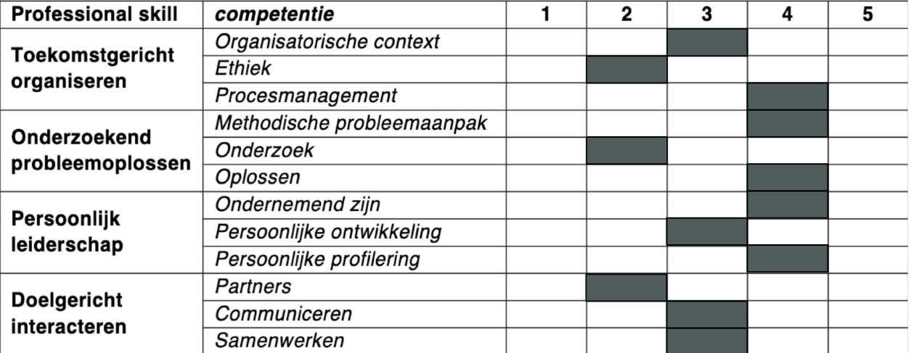

# COP Rinaldo

## Stap 1:
Naam: Rinaldo Rong Daalman\
Studentnummer: 500921627\
Periode waarop het COP betrekking heeft: 2024/2025\
Datum van opstellen: 12-10-2024\
Naam van je loopbaanadviseur/studentbegeleider: Maarten Post

## Stap 2:
### 1. Waar komt jouw interesse voor ICT vandaan?
Mijn interesse voor ICT begon al op jonge leeftijd toen ik veel Minecraft speelde. Het bouwen van verschillende dingen 
vond ik altijd geweldig. Dit groeide uit tot een passie voor het creëren van nieuwe dingen, waardoor ik als kind al wist 
dat ik iets in die richting wilde doen. Later, toen ik voor mijn studie moest kiezen, twijfelde ik tussen bouwkunde en 
iets anders. Na wat onderzoek via studiewijzers kwam ik terecht bij een IT-opleiding, specifiek Software Engineering. 
Hoewel ik er eigenlijk weinig vanaf wist, begon ik video's te kijken op YouTube en werd ik meteen enthousiast. Het 
idee om websites en complexe systemen te ontwikkelen sprak me enorm aan. Mijn eerste 'Hello World' in HTML voelde alsof 
ik de nieuwe Mark Zuckerberg was, maar al snel besefte ik dat er nog veel te leren viel.

### 2. Hoe heb je de keuze gemaakt voor HBO-ICT en wie heeft daarin een rol gespeeld?
De keuze voor HBO-ICT heb ik grotendeels zelf gemaakt, maar mijn vader speelde een belangrijke rol in mijn motivatie. 
Hij heeft me altijd geholpen bij het nadenken over welke keuzes goed voor me zouden zijn. Hij vond dat ICT goed bij me 
paste en wees op de vele mogelijkheden en groeikansen binnen de sector. Dit heeft me over de streep getrokken om voor 
deze opleiding te kiezen.

### 3. Welke beroepstaken en beroepshandelingen spreken je aan? Welke minder?
Het coderen zelf vind ik fantastisch. Het maken van websites of apps, waarbij ik mijn creativiteit kan gebruiken om iets 
nieuws te bouwen, is wat me het meest aanspreekt. Wat ik minder leuk vind, zijn de voorbereidende stappen zoals het maken 
van UML-diagrammen, ERD's en Sequence Diagrams. Hoewel ik begrijp dat dit belangrijk is voor het eindproduct, vind ik 
deze taken veel minder leuk.

### 4. Wat voor stage zou je willen doen en wat wil je er leren?
Ik heb nog geen specifiek bedrijf in gedachten, maar ik weet wel dat ik stage wil lopen bij een bedrijf waar ik zowel 
front-end als back-end kan leren, dus Fullstack. Ik wil zoveel mogelijk kennis opdoen, omdat 
ik het belangrijk vind om veelzijdig te zijn. Beide onderdelen zijn belangrijk voor het maken van een goed werkend 
product, en daarom wil ik me ontwikkelen tot Fullstack engineer.

### 5. Wil je je verbreden of verdiepen na je stage?
Ik wil me zeker verder verdiepen in de ICT. Zoals ik al zei, vind ik het leuk om zoveel mogelijk te leren, zelfs als het 
soms moeilijk is. Hoe meer kennis ik heb, hoe waardevoller ik kan zijn voor een bedrijf, en dat lijkt me een goed gevoel.

### 6. Wat wil je na je studie doen?
Na het behalen van mijn bachelor wil ik graag een master doen, bij voorkeur in Artificial Intelligence (AI). AI spreekt 
me enorm aan vanwege de nieuwe dingen en de toekomstmogelijkheden. Eerst wilde ik direct AI studeren aan de VU, 
maar ik besloot breder te beginnen (ICT aan de HVA), om daarna meer de focus op AI te leggen in mijn master.

## Stap 3:
### 1. Welke onderdelen van je studie motiveren je (en waarom)?
Het coderen is zonder twijfel mijn grootste motivatie, vooral omdat ik hierbij echt dingen kan bouwen. Zodra ik een 
duidelijk beeld heb van wat ik wil maken, vind ik het fantastisch om het daadwerkelijk te kunnen coderen. Daarom zie ik 
ook het nut in van het maken van ERD's en UML's, omdat ze me helpen mijn ideeën werkelijk te maken voordat ik begin met 
programmeren.

### 2. Waar heb je moeite mee?
Ik heb soms moeite met het duidelijk uitleggen van mijn code aan anderen. Vaak gebruik ik eigen termen of vergelijkingen 
die niet altijd voor iedereen begrijpelijk zijn. Bijvoorbeeld, als ik iets uitleg, gebruik ik vaak voorbeelden zoals 
auto's om mijn punt te verduidelijken, maar dat werkt niet altijd voor iedereen. Dit gaat wel steeds beter, omdat ik 
vaker mijn code aan anderen moet uitleggen, maar het blijft soms lastig.

#### 1. Organisatorische context:
Ik begrijp goed hoe een organisatie/bedrijf in elkaar zit en hoe teams werken. Ik kan mijn werk prima afstemmen op wat het team 
nodig heeft en zorg ervoor dat ik de doelen van het team voor ogen hou. Hoewel dit goed gaat, weet ik dat er nog ruimte 
is om meer te leren over hoe alles binnen een bedrijf samenwerkt, zodat ik daar nog beter in kan worden.

#### 2. Ethiek:
Mijn kennis over ethiek in de ICT is nog matig. Ik ben me nog niet genoeg bewust van de ethische problemen die kunnen 
ontstaan bij het werken met technologie. Dit is een gebied waar ik zeker in wil groeien, zodat ik beter kan begrijpen 
wat goed en fout is in verschillende situaties en hoe ik deze problemen kan aanpakken.

#### 3. Procesmanagement:
Mijn vaardigheden in procesmanagement zijn redelijk goed. Ik kan projecten op een gestructureerde manier organiseren en 
zorgen dat alles goed verloopt. Hoewel ik al goed kan omgaan met verschillende taken en verantwoordelijkheden, wil ik 
mezelf nog verder verbeteren om grotere en complexere projecten beter te kunnen managen, die vind ik namelijk wat lastiger.

#### 4. Methodische probleemaanpak:
Mijn methodische aanpak bij het oplossen van problemen is redelijk goed. Ik ben sterk in het stap voor stap aanpakken 
van problemen, vooral wanneer ik een duidelijk plan heb. Hoewel dit goed gaat, wil ik mezelf nog verder ontwikkelen door 
sneller een aanpak te bedenken, vooral in situaties waar tijd belangrijk is.

#### 5. Onderzoek:
Mijn onderzoeksvaardigheden zijn nog niet zo goed. Ik neem vaak te weinig tijd om grondig onderzoek te doen en dit zorgt 
ervoor dat ik niet altijd de beste informatie of oplossingen vind. Ik wil mezelf hierin verbeteren door meer tijd en 
aandacht te besteden aan het verzamelen en analyseren van gegevens, zodat ik betere resultaten kan krijgen.

#### 6. Oplossen:
Mijn vaardigheden in het oplossen van problemen zijn redelijk prima. Ik kan goed omgaan met technische problemen en weet 
meestal een oplossing te vinden. Toch zie ik ruimte om mezelf te verbeteren, vooral in het sneller vinden van 
oplossingen voor ingewikkeldere problemen.

#### 7. Ondernemend zijn:
Mijn ondernemendheid is redelijk prima. Ik kom vaak met nieuwe ideeën en toon initiatief wanneer dat nodig is. Toch merk 
ik dat ik soms wat enthousiast ben en veel extra dingen wil doen of maken. Ik moet leren om eerst de belangrijkste dingen
in een project te doen en daarna pas de leuke snufjes.

#### 8. Persoonlijke ontwikkeling:
Mijn persoonlijke ontwikkeling is redelijk, maar er is zeker ruimte voor verbetering. Ik richt me vaak op de dingen die 
ik leuk vind, zoals coderen, maar ik weet dat ik ook meer aandacht moet besteden aan de voorbereidingen die voorafgaan 
aan het programmeren, zoals het maken van plannen en diagrammen. Door ook deze minder leuke dingen serieus te nemen, kan 
ik mezelf verder ontwikkelen en beter worden in het hele proces.

#### 9. Persoonlijke profilering:
Mijn persoonlijke profilering is best goed. Ik weet hoe ik mezelf kan presenteren en welke vaardigheden ik moet laten 
zien om op te vallen. Ik ben me bewust van mijn sterke punten en hoe ik die kan gebruiken om mezelf te onderscheiden.

#### 10. Partners:
Ik vind het soms nog lastig om te weten wie wat precies doet bij partners. Soms is de code onduidelijk of 
gebruiken mensen verschillende woorden in de code, wat de communicatie moeilijker maakt en me in de war kan brengen. Dit komt vaak 
doordat ik liever alleen werk en het moeilijker vind om samen te werken met mensen die ik nog niet zo goed ken 
(aangezien iedereen wat anders gewend is). Toch gaat het steeds beter, en ik werk eraan om mijn samenwerking en 
communicatie met anderen te verbeteren.

#### 11. Communiceren:
Mijn communicatievaardigheden zijn redelijk prima. Ik communiceer duidelijk, vooral mondeling gaat het goed. 
Soms kan ik nog wel werken aan mijn schriftelijke communicatie, vooral bij het appen kunnen dingen soms anders overkomen 
dan ik eigenlijk bedoel, maar over het algemeen gaat het prima en blijf ik mezelf hierin verbeteren.

#### 12. Samenwerken:
Mijn vaardigheden in samenwerken zijn prima. Ik werk graag in een team en begrijp goed wat mijn rol is binnen de groep. 
Ik kan goed bijdragen aan het team en zorg ervoor dat we samen vooruitgang boeken. Hoewel dit goed gaat, wil ik 
mezelf blijven verbeteren om ook in lastigere situaties, zoals bij conflicten, goed te blijven samenwerken.